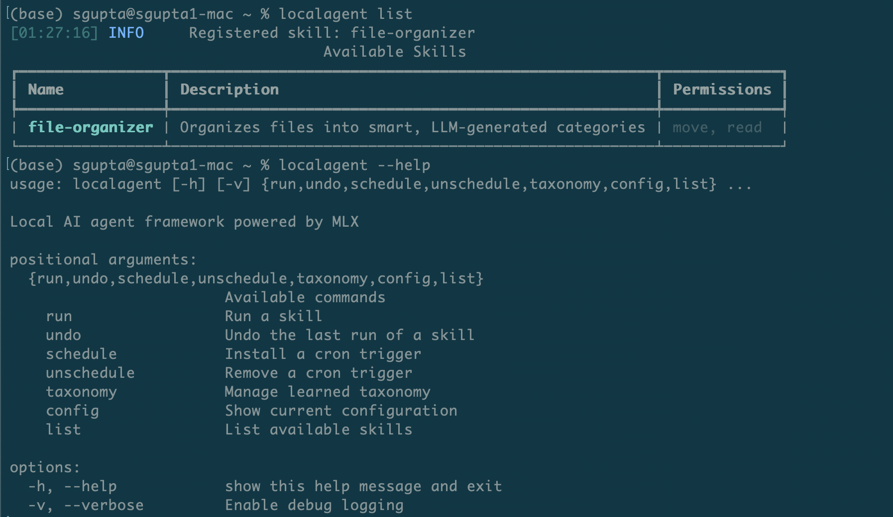

# LocalAgent

A local AI agent framework powered by [MLX](https://github.com/ml-explore/mlx) for running autonomous skills on Apple Silicon. Everything runs on-device -- no cloud APIs, no data leaving your machine.

## Overview

LocalAgent provides a plugin-based skill system where each skill is an autonomous agent that can be triggered manually or on a schedule. Skills interact with the local filesystem through a sandboxed API with strict permission enforcement.

See [GUARDRAILS.md](GUARDRAILS.md) for the safety architecture.

## Requirements

- macOS with Apple Silicon (M1+)
- Python 3.12+
- MLX and mlx-lm (pulled in as dependencies via `pip install`)

## Installation

```bash
git clone <repo-url> && cd localagent
pip install -r requirements.txt
pip install -e ".[dev]"
```

On first run, the default model (`mlx-community/Llama-3.2-3B-Instruct-4bit`) will be downloaded from HuggingFace if not already cached.

## Quick Start



```bash
localagent list                          # List available skills
localagent run <skill>                   # Run interactively (dry-run + confirm)
localagent run <skill> --auto            # Auto-execute (for cron)
localagent undo <skill>                  # Undo last run
localagent undo <skill> --interactive    # Selectively undo
localagent schedule <skill>              # Install daily cron trigger
localagent unschedule <skill>            # Remove cron trigger
localagent eval <skill>                  # Run evals against configured model
localagent config                        # Show configuration
```

## Skills

| Skill | Description | Docs |
|---|---|---|
| [file-organizer](src/localagent/skills/file_organizer/) | Scans directories, uses the LLM to generate an adaptive taxonomy from file content, and organizes files into semantic categories | [README](src/localagent/skills/file_organizer/README.md) |

## Configuration

Configuration lives at `~/.config/localagent/config.yaml`. A default is created on first use.

```yaml
model:
  model_path: "mlx-community/Llama-3.2-3B-Instruct-4bit"
  max_tokens: 2048
  temperature: 0.3
```

To swap models, change `model_path` to any MLX-compatible model (e.g. a quantized Gemma, Phi, or Mistral). Each skill has its own config section -- see the skill's README for details.

## Evals and Benchmarking

Every skill can ship with eval scenarios that test LLM output quality. Run evals to score a model, or benchmark multiple models side-by-side:

```bash
# Eval with the configured default model
localagent eval file-organizer

# Benchmark multiple models head-to-head
localagent eval file-organizer \
  --model mlx-community/Llama-3.2-3B-Instruct-4bit \
  --model mlx-community/gemma-2-9b-it-4bit \
  --model mlx-community/Qwen2.5-14B-Instruct-4bit \
  --output benchmark.yaml
```

## Safety

Skills operate in a sandbox with no ability to delete files, access directories outside their config, or bypass permission checks. See [GUARDRAILS.md](GUARDRAILS.md) for the complete safety architecture.

## Project Structure

```
src/localagent/
├── cli.py                          # CLI entry point
├── config.py                       # Config loading and merging
├── core/
│   ├── engine.py                   # MLX model wrapper
│   ├── safefs.py                   # Sandboxed filesystem API
│   ├── skill.py                    # Skill ABC and manifest
│   ├── registry.py                 # Skill discovery and instantiation
│   └── triggers.py                 # Cron scheduling
├── evals/
│   ├── scenario.py                 # EvalScenario ABC, EvalScore, EvalResult
│   ├── runner.py                   # Run scenarios against models, save results
│   └── report.py                   # Rich terminal reporting and leaderboards
└── skills/
    └── file_organizer/
        ├── evals/scenarios.py      # Eval scenarios for categorization quality
        └── ...                     # Skill implementation (see its README)
```

## Tests

```bash
pytest tests/ -v
```

## License

MIT License. See [LICENSE](LICENSE).
